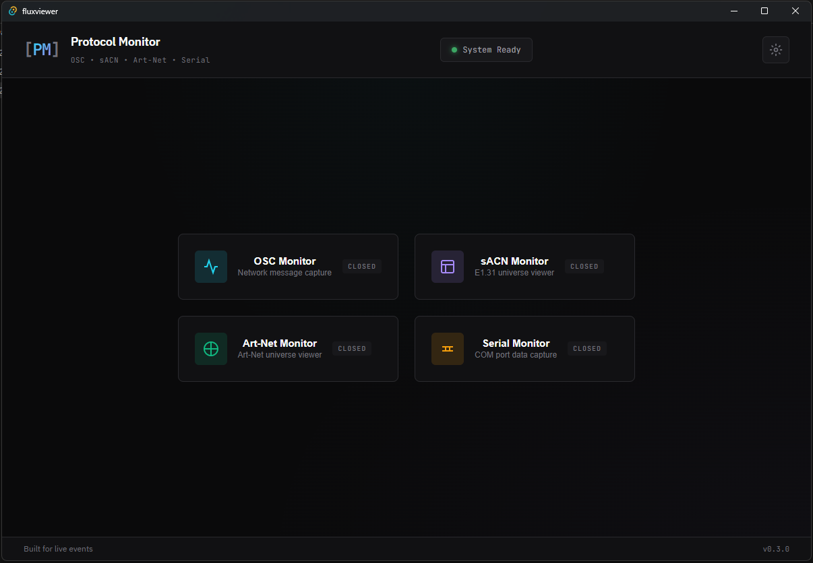

# Protocol Monitor

A real-time protocol monitoring tool for live events and entertainment production. Built with Tauri, React, and Rust.



## Features

### OSC Monitor
- Real-time Open Sound Control message capture
- Configurable listen IP and port
- Filter messages by address or sender
- Pause/resume and clear functionality
- Displays timestamp, address, arguments, and sender

### sACN Monitor (E1.31)
- Real-time streaming ACN universe viewer
- 512-channel grid display (16 columns)
- Color-coded intensity visualization
- Multi-universe support with tab switching
- Compact and expanded view modes

### Art-Net Monitor
- Real-time Art-Net universe viewer
- Same feature set as sACN monitor
- Supports Art-Net universes starting at 0

### Serial Monitor
- COM/serial port data capture
- Hex dump view with offset, hex bytes, and ASCII columns
- ASCII view with configurable line delimiters
- Configurable baud rate (300 - 921600)
- Auto-detects available ports

## Installation

### Pre-built Binaries

Download the latest release for your platform from the [Releases](https://github.com/Koxuvar/ViewerApp/releases) page.

### Build from Source

#### Prerequisites
- [Node.js](https://nodejs.org/) (v18+)
- [Rust](https://rustup.rs/) (latest stable)
- [Tauri CLI](https://tauri.app/v1/guides/getting-started/prerequisites)

#### Steps
```bash
# Clone the repository
git clone https://github.com/yourusername/protocol-monitor.git
cd protocol-monitor

# Install frontend dependencies
npm install

# Run in development mode
npm run tauri dev

# Build for production
npm run tauri build
```

## Usage

1. **Configure Network Settings** - Click the gear icon to set listen IPs, ports, and universe ranges
2. **Open a Monitor** - Click any protocol button to open its monitoring window
3. **Drag and Position** - Windows can be dragged and positioned anywhere
4. **Filter and Analyze** - Use built-in filters and view modes to focus on relevant data

### Network Configuration

| Protocol | Default Port | Notes |
|----------|-------------|-------|
| OSC | 8000 | Configurable |
| sACN | 5568 | Fixed (E1.31 standard) |
| Art-Net | 6454 | Fixed (Art-Net standard) |
| Serial | N/A | Local COM ports |

Set IP to `0.0.0.0` to listen on all network interfaces.

## License

MIT License - see [LICENSE](LICENSE) for details.

## Contributing

Contributions welcome! Please open an issue or submit a pull request. See [CONTRIBUTIONS](CONTRIBUTIONS) for more details.

## Acknowledgments

Built for the live events community. Inspired by tools like sACNView, Art-Net View, and Protokol.
